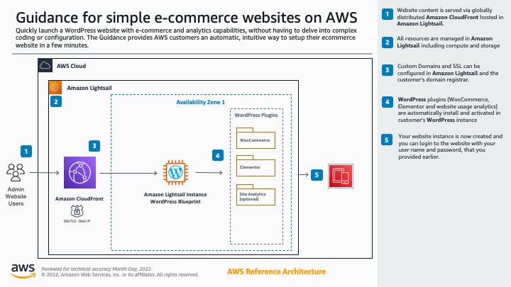

## Introduction
Simple E-commerce Website on AWS enables SMBs and Partners to quickly launch a WordPress website with e-commerce and analytics capabilities, without having to delve into complex coding or configuration. The Solution provides AWS customers an automatic, intuitive way to setup their website and also provides them optional AWS services to augment their website needs like backup and security.  

## Support

The sample code; software libraries; command line tools; proofs of concept; templates; or other related technology (including any of the foregoing that are provided by our personnel) is provided to you as AWS Content under the AWS Customer Agreement, or the relevant written agreement between you and AWS (whichever applies). You should not use this AWS Content in your production accounts, or on production or other critical data. You are responsible for testing, securing, and optimizing the AWS Content, such as sample code, as appropriate for production grade use based on your specific quality control practices and standards. Deploying AWS Content may incur AWS charges for creating or using AWS chargeable resources, such as running Amazon EC2 instances or using Amazon S3 storage.

## Prerequisites

In order to deploy Simple E-commerce Website on AWS, you must first create an AWS account and have access to AWS CloudFormation. Additionally, the solution uses secrets stored in AWS Secrets Manager. To create a secret in AWS Secrets Manager, learn more in the [AWS Secrets Manager documentation.](https://docs.aws.amazon.com/secretsmanager/latest/userguide/intro.html)

## Architecture

1. Website content is served via globally distributed Amazon CloudFront hosted in Amazon Lightsail. 
2. All resources are managed in Amazon Lightsail including compute and storage
3. Custom Domains and SSL can be configured in Amazon Lightsail and the customer’s domain registrar.
4. WordPress plugins (WooCommerce, Elementor and website usage analytics) are automatically install and activated in customer’s WordPress instance
5. Your website instance is now created and you can login to the website with your user name and password, that you provided earlier.

